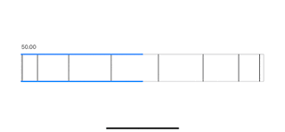

# WheelControl

A wheel control in SwiftUI.

## Basic Principle

Goal: provide a control that allows the user to set an arbitrary floating point value within a range, with fine precision.
- Keyboard input: cumbersome and not intuitive
- Slider: inaccurate and precision limited by real-estate

Proposed solution: a wheel control with multiple speeds.

|  |
|-|

|  |
|-|

|  |
|-|

## Visuals and interaction

- The wheel is framed by a rectangle to provide spatial reference
- The wheel is materialized by lines parallel to rotation axis. The lines' spacing conveys the circular shape of the wheel. Their motion when the wheel is dragged conveys direction and speed.
- Value level indicators map the long direction of the wheel to the possible range of values. When the wheel is dragged at various speeds, the speed of change in the level conveys the relative effect of the wheel's rotation.
- Cycle through available speeds by double tapping the control.
- The current speed is conveyed by the density of lines on the wheel.

## Usage

The control applies to a variable of type Float via binding.

The parent view (or an associated model) defines the bound value, which is passed to the control, together with the range of allowed values for the variable, an orientation (vertical, horizontal or automatically inferred from view geometry) and an optional commit callback which, if defined, is called in the DragGesture's onCommit callback (this is useful to apply changes only when interaction concludes rather than on all updates).

```
struct ContentView: View {
    @State private var value = Float(1.0)

    var body: some View {
        VStack(alignment: .leading) {
            Text("\(value, specifier: "%.2f")")
            WheelControl(value: $value, range: 0.0...100.0, orientation: .horizontal)
                .frame(maxHeight: 80)
        }
        .padding()
    }
}
```

## Possible improvements

- Make generic (for Float, Double and Int)
- Handle closed and open ranges
- Add haptics feedback
- etc.
